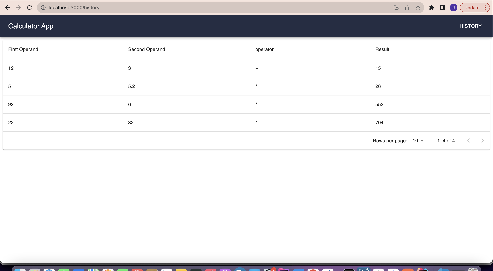

# Calculator App

A Calculator application client built in React and Material UI

# Features
 - Create Operation (Additional,Subtraction, Division etc)
 - View Calculation History

 
 

Clone this repository to your machine and run `npm install` to install all the dependencies.

Copy `.env.example` and rename it as `.env`

Set all the environment variables as needed.

Then run `npm install`

run `npm start` to start application

The APP is now running. Copy the url link provided and paste it on your favourite
browser. It should look like `http://localhost:3000/` this will display the claculator.

